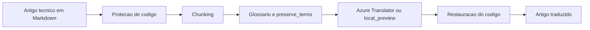

# Tradutor de Artigos Tecnicos com Azure AI

## O que o projeto entrega

- API REST para traducao de artigos tecnicos
- preservacao de blocos de codigo e inline code
- glossario customizado por requisicao
- lista de termos que nao devem ser traduzidos
- chunking de markdown para textos longos
- integracao opcional com Azure Translator
- modo `local_preview` para demonstracao sem credenciais
- testes automatizados
- Dockerfile para execucao local

## Arquitetura do fluxo



## Endpoints

### `GET /health`

Retorna o status da API.

### `POST /api/translate/article`

Traduz um artigo tecnico em texto puro ou markdown.

Exemplo de payload:

```json
{
  "title": "Deploying a FastAPI Service",
  "content": "# Deploying a FastAPI Service\n\nThe service exposes an endpoint for authentication and cache invalidation.\n\n```python\ndef authenticate_user(token: str) -> bool:\n    return token.startswith(\"Bearer \")\n```\n\nUse `docker compose up` to start the environment.\n",
  "target_language": "pt-br",
  "source_language": "en",
  "glossary": {
    "authentication": "autenticacao",
    "cache invalidation": "invalidacao de cache",
    "endpoint": "endpoint"
  },
  "preserve_terms": [
    "FastAPI",
    "docker compose up"
  ]
}
```

## Como executar localmente

### Com Python

```bash
pip install -r requirements.txt
uvicorn app.main:app --reload
```

### Com Docker

```bash
docker build -t tradutor-azureai .
docker run -p 8000:8000 tradutor-azureai
```

## Configuracao do Azure Translator

Crie um recurso de Translator no Azure e configure:

- `AZURE_TRANSLATOR_KEY`
- `AZURE_TRANSLATOR_ENDPOINT`
- `AZURE_TRANSLATOR_REGION`

Exemplo de base em [.env.example](.env.example).

Se essas variaveis nao estiverem presentes, a API responde em modo `local_preview`, que serve para demonstrar o pipeline de preprocessamento e pos-processamento, mas nao substitui uma traducao real da nuvem.

## Estrutura do projeto

- `app/main.py`: endpoints da API
- `app/translator.py`: integracao com Azure Translator e fallback local
- `app/segmenter.py`: protecao de codigo e chunking
- `app/models.py`: contratos da API
- `tests/test_translator.py`: testes do fluxo principal
- `docs/translation-strategy.md`: explicacao da estrategia de traducao
- `examples/sample-request.json`: payload pronto para teste

## Referencias oficiais

Para alinhar o projeto com a forma atual de uso do Azure, usei como base documentacao oficial da Microsoft sobre Translator e Text Translation:

- [Quickstart: translate text programmatically](https://learn.microsoft.com/en-us/azure/ai-services/translator/text-translation/quickstart/rest-api)
- [Use Azure Translator REST APIs](https://learn.microsoft.com/en-us/azure/ai-services/translator/text-translation/how-to/use-rest-api)
- [Translator v3.0 Translate method](https://learn.microsoft.com/azure/ai-services/translator/reference/v3-0-translate)
- [Dynamic Dictionary](https://learn.microsoft.com/en-us/azure/ai-services/translator/text-translation/how-to/use-dynamic-dictionary)

Observacao: o projeto usa a ideia de dynamic dictionary para glossario de termos tecnicos. Pela documentacao oficial, esse recurso deve ser usado com parcimonia e exige `from` explicito, alem de envolver ingles e outro idioma suportado.

## Validacao

```bash
pytest
```

Os testes cobrem:

- protecao e restauracao de blocos de codigo
- chunking de markdown
- aplicacao de glossario no modo local
- resposta HTTP do endpoint principal

## Proximos passos

- adicionar upload de arquivo `.md` e `.txt`
- gerar lado a lado original versus traducao
- salvar memoria de traducao por projeto
- incluir interface web simples
- adicionar suporte a DOCX e PDF
